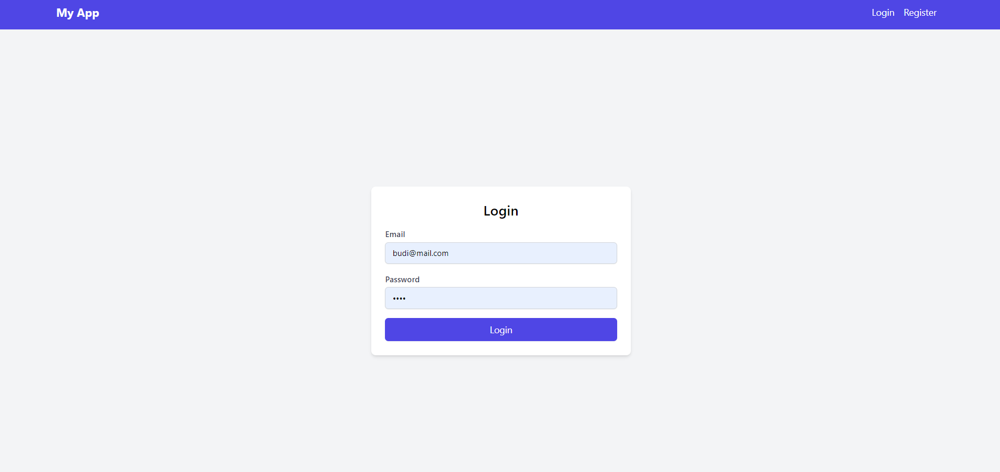
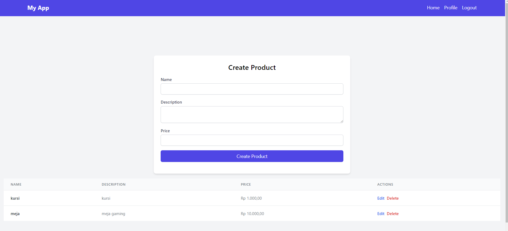
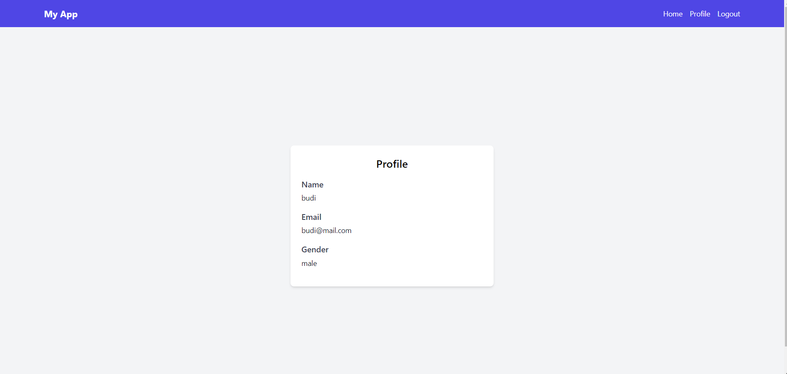
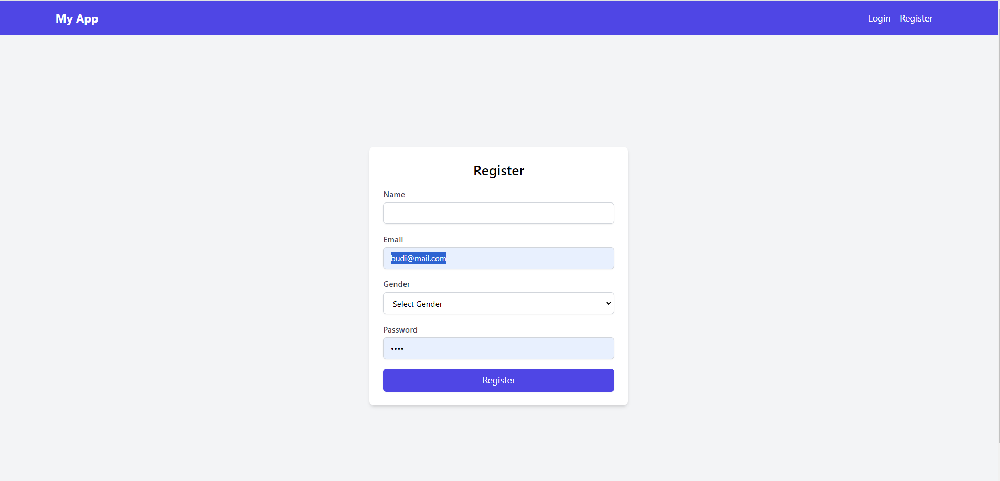

# CRUD Product Express JS

## Backend/Server

adjust config/config.json

adjust the username,password and the name of database in config/config.json
create the database first manually on dbeaver postgres

```bash
"development": {
"username": "postgres",
"password": "\*\*\*\*",
"database": "CRUD_NodeJS",
"host": "127.0.0.1",
"dialect": "postgres"
}
```

intall the dependencies

```
npm install
```

start the backend server

```
node server.js
```

# Frontend/Client

```
cd client
npm install
npm run dev
```

## Screenshot

Here is an example screenshot of the project:

## Login



## Home



## Profile



## Register


